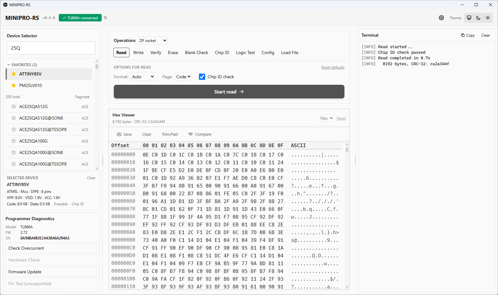
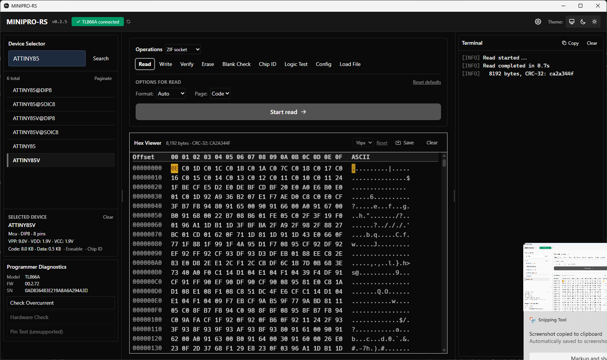

<p align="center">
  
</p>

# minipro-rs

[](https://gitlab.com/arcturus8081/minipro-rs/-/pipelines)
[](https://github.com/Arcturus808/minipro-rs/releases)
[](LICENSE)
[](https://www.rust-lang.org)
[](https://github.com/sponsors/Arcturus808)

A Rust reimplementation of [minipro](https://gitlab.com/DavidGriffith/minipro) — an open-source program for controlling XGecu's TL866xx/T48/T56/T76 series of chip programmers.

> **Status:** CI/CD pipeline fully operational — clippy, fmt, tests, Linux/Windows release builds, and all package jobs (`.deb`, `.rpm`, `.msi`, shell completions) passing on every commit. macOS builds are available via [GitHub Actions](https://github.com/Arcturus808/minipro-rs/releases) (see [macOS support](#macos-support)).

> **Bug reports & hardware test results:** [open an issue on GitLab](https://gitlab.com/arcturus8081/minipro-rs/-/issues)

> **This is a spare-time project.** Bug reports and hardware test results are welcome. Please be patient with response times (days to weeks, not hours). For urgent issues, consider contributing a PR — the codebase is well-structured and the [architecture is documented](#architecture-plan). The [GitHub repo](https://github.com/Arcturus808/minipro-rs) is a mirror for release builds only; all issues and merge requests should go to [GitLab](https://gitlab.com/arcturus8081/minipro-rs).

---

## GUI — MINIPRO-RS (Tauri + Svelte)

A native desktop GUI is included in the `gui/` directory. It is built with **Tauri v2** + **Svelte 5** + **Tailwind CSS** and ships as a single `.msi` / `.exe` installer on Windows. The installer includes the full 13,000+ device database (`infoic.xml` / `logicic.xml`) — no separate download needed.

### Screenshots

**Light theme:**



**Dark theme:**



### Features

**Core operations:**
- Read / Write / Verify / Erase / Blank Check / Chip ID / Logic Test / Config
- **Write with auto-erase and auto-verify**: automatically erases before writing and verifies afterward (skippable)
- **Read-to-memory**: chip reads go directly to the hex viewer — no immediate file save required
- **Chip ID verification**: automatic chip ID read and comparison before read/write/erase/verify; fails with clear mismatch message if inserted chip doesn't match selected device; `--skip-device-id` CLI flag and GUI checkbox to bypass
- **"Size diff" handling**: Error / Warn / Ignore modes when file size doesn't match device memory size

**Hex viewer & analysis:**
- **Hex viewer** with Save, Open Folder, and Clear buttons — **virtualized rendering** for instant load/clear of large files; now with **in-place editing**: click any hex byte or ASCII character to edit, with type-through overflow and keyboard navigation (arrows, Enter, Escape, Backspace)
- **Smart firmware diff** — compare the hex viewer buffer against a reference file with a single click. Byte-aligned comparison with three-way tail classification: differing bytes highlighted in red, trailing erase-value padding shown in gray (ignored), and anomalous non-padding data beyond the shorter buffer flagged in amber with a warning banner. Navigate between diffs with Prev/Next buttons or F3/Shift+F3. CLI: `minipro --diff fileA fileB [--erase-value 0xFF]`
- **Manual trim/pad** — "Trim/Pad" button in hex viewer toolbar. Trim removes trailing fill bytes; Pad extends to a target size. Fill byte dropdown supports 0xFF (NOR flash) and 0x00 (EEPROM/NAND)

**Batch programming:**
- **Batch programming** — program multiple identical chips with the same firmware image. CLI: `minipro -p DEVICE -w file.bin --batch [N]` prompts to insert the next chip after each successful write + verify. GUI: "Batch Mode" toggle in the write panel with "Next Chip" / "Retry" / "Stop Batch" buttons and live pass/fail counter
- **Auto-incrementing serial numbers** — inject a unique serial number into each chip during batch programming. CLI: `--serial-start 1 --serial-addr 0x1FF0 --serial-width 4 --serial-format bin --serial-endian little --serial-step 1 --serial-checksum none`. Supports binary (little/big endian), ASCII (zero-padded decimal), and BCD formats with optional XOR or CRC-8 checksum. GUI: collapsible "Serial Number" section in batch options with live preview showing serial range
- **Serial overflow detection** — errors if the serial value exceeds the width's max (e.g., 0xFFFF for 2-byte) instead of silently truncating. CLI checks before batch start; GUI shows live warning and blocks start

**MCU support:**
- **Fuse and lock-bit editor** (Config tab): auto-populated from database defaults when a device is selected; read/write MCU configuration bytes with checkbox UI and direct hex input; fuses and lock bits displayed side-by-side
- **OSCCAL calibration preservation**: for PIC microcontrollers with `osccal_save=1`, the factory RC oscillator calibration word is automatically saved before erase and restored afterward, preventing clock accuracy loss

**Safety features:**
- **Lock-bit protection safeguards**: warns before read/write when lock bits indicate protection is active
- **Package variant warnings**: warns when `@DIP8`/etc. variants are selected, as they often have incorrect protocol configs
- **No-chip-ID warning**: yellow banner when the selected device lacks chip ID support, reminding user to verify correct chip insertion
- **USB reconnect hints** — connection button tooltip and error messages advise replugging on USB-related failures (Windows Selective Suspend, Linux autosuspend, macOS sleep power management)

**UI & usability:**
- Device search & selection with **live search as you type** (200ms debounce), **device favorites** with star toggle (persisted to localStorage), pinned collapsible favorites section, and **manufacturer name** shown alongside each result
- **Two-step operation flow**: select operation → configure options → click Start
- **Context-aware options panel**: only relevant controls shown per operation
- Live progress bar with CRC32 verification
- Terminal-style log panel with **Copy to clipboard** button and drag-select support
- Diagnostics panel (programmer info, overcurrent check, hardware check)
- Adjustable hex viewer font size (10-16px) with persistence, using the **Hack** open-source monospace font
- **Draggable panel splitters**: resize Device Selector, Hex Viewer, and Terminal to your preference — widths persist across sessions
- **Layout reset** in Settings: one-click restore of panel widths, font size, and window position
- Settings persistence (theme, operation defaults, last directory, hex font size, panel widths)
- Icon-based top bar (gear settings, monitor/moon/sun theme toggles)

### Download

Pre-built GUI installers are available on the [GitHub Releases](https://github.com/Arcturus808/minipro-rs/releases) page:

| Platform | Installer |
|----------|-----------|
| **Windows** | `.msi` (recommended) or `.exe` (NSIS) |
| **Linux** | `.AppImage` (universal) or `.deb` (Debian/Ubuntu) |
| **macOS** | `.dmg` (Apple Silicon — M1/M2/M3) |

> **Note:** The GUI releases are built from a [GitHub mirror](https://github.com/Arcturus808/minipro-rs) of this repository. The CLI releases remain on [GitLab](https://gitlab.com/arcturus8081/minipro-rs/-/releases).

### Quick start

```bash
cd gui
npm install
cargo tauri dev        # development with hot-reload
cargo tauri build      # production installer (.msi + .exe)
```

See [`gui/README.md`](gui/README.md) for full documentation including architecture, project structure, and development notes.

### Third-party GUIs

`minipro-core` is a plain Rust library crate, so you can also build your own GUI front-end:

```toml
[dependencies]
minipro-core = { path = "../minipro-rs/crates/minipro-core" }
```

Wrap blocking USB calls in `tokio::task::spawn_blocking` and use the `(bytes_done, total_bytes)` progress callback to drive your UI.

---

## Goals

- Full feature parity with the C `minipro` 0.7.x (in progress — see [ROADMAP.md](ROADMAP.md) for remaining protocol gaps)
- **Native Windows 11 support** — no Cygwin, no MSYS2, no WSL, no `libusb` DLL; builds and runs with only `rustup` + `cargo`
- Cross-platform (Linux, macOS, Windows) without requiring a separately installed `libusb`
- Idiomatic Rust: strong types, `Result`-based error handling, no unsafe except at the USB boundary
- Library (`minipro-core`) + binary (`minipro-cli`) split so third-party GUIs (including [Tauri](#gui--minipro-rs-tauri--svelte)) can embed the core

---

## Windows support

> **Note on antivirus false positives:** Some AV vendors (notably Bkav Pro) heuristically flag this binary because Rust's standard library links `ws2_32.dll` (Windows Sockets) on all Windows targets, even when the program never uses networking. This is a known characteristic of every Rust Windows binary, not malware. You can verify the binary integrity via the [VirusTotal scan linked in each release](https://gitlab.com/arcturus8081/minipro-rs/-/releases) or build from source yourself. A code-signing certificate is on the roadmap.
>
> **GitLab vs. GitHub Windows binaries:** Windows `.exe` and `.msi` files on the [GitLab release page](https://gitlab.com/arcturus8081/minipro-rs/-/releases) are cross-compiled from Linux using MinGW-w64. This produces a PE structure that differs from native MSVC builds and may trigger additional heuristic detections (e.g., Kaspersky `VHO:Backdoor.Win64.AdaptixC2.gen`). The same source code builds on [GitHub Actions](https://github.com/Arcturus808/minipro-rs/releases) using native MSVC and scans clean. **Windows users should download from GitHub Releases.**
>
> **macOS CLI binary:** The standalone `minipro-cli-macos-aarch64` binary may trigger heuristic detections on VirusTotal (e.g., Microsoft Defender `PUA:Win32/Puwaders.C!ml`) — a machine learning false positive that incorrectly applies Windows PUA rules to a macOS binary. The macOS GUI `.dmg` scans clean. **macOS users should prefer the GUI `.dmg` installer.** Linux binaries are unaffected.

### For end users

The distributed binary is a **single self-contained `.exe`** with no installation required beyond placing it on `PATH`.  No Cygwin, no MSYS2, no WSL, no Visual C++ Redistributable, no `libusb-1.0.dll`.

**One-time USB driver step** — Windows associates USB devices with a driver that persists across reboots.  The programmer's interface must be associated with Microsoft's built-in **WinUSB** driver before first use:

1. Download and run [Zadig](https://zadig.akeo.ie/) (free, no install needed).
2. Select the XGecu programmer from the device list.
3. Choose **WinUSB** and click **Install Driver**.

This is a one-time step per machine.  It is the same requirement the original C `minipro` has on Windows — this project does not add any new hurdle; it only removes the `libusb` runtime layer that sat on top.

**GUI installer** — The `.msi` / `.exe` installer includes the full chip database and the Hack font. After installation, run `MINIPRO-RS` from the Start Menu. No manual file copying needed.

### For developers

| What you need | What you do NOT need |
|---|---|
| [rustup](https://rustup.rs/) (Rust toolchain) | Cygwin / MSYS2 / WSL |
| `cargo build --release` | C compiler (gcc / clang / MSVC) |
| Zadig (one-time, per machine) | `libusb`, `pkg-config`, or any C library |

The USB layer uses [`nusb`](https://crates.io/crates/nusb) — a pure-Rust library that calls the Windows WinUSB API directly through Rust's `windows-sys` bindings.  There is no C FFI, no `.dll` to bundle, and no system-level package manager step.

```powershell
# Clone and build on Windows — this is all that is required
git clone https://gitlab.com/your-fork/minipro-rs
cd minipro-rs
cargo build --release
# Binary is at target\release\minipro.exe
```

---

## CLI usage

```sh
# Read a chip to a file
minipro -p AT28C256 -r dump.bin

# Write a file to a chip (auto-erases and auto-verifies by default)
minipro -p AT28C256 -w firmware.bin

# Erase a chip
minipro -p AT28C256 -E

# Verify a chip against a file
minipro -p AT28C256 -m firmware.bin

# Read chip ID
minipro -p W25Q128 -D

# Blank-check a chip
minipro -p AT28C256 -b

# List all supported devices
minipro -l

# Search for a device by name
minipro -l 25Q

# Batch programming (program N chips with the same firmware)
minipro -p W25Q128 -w firmware.bin --batch 10

# Write with auto-incrementing serial numbers
minipro -p AT28C256 -w firmware.bin --batch 10 \
  --serial-start 1 --serial-addr 0x1FF0 --serial-width 4 \
  --serial-format bin --serial-endian little --serial-step 1

# Compare two firmware files
minipro --diff fileA.bin fileB.bin

# Show device info from database (no programmer needed)
minipro -d AT28C256

# Show connected programmer info
minipro --info
```

Run `minipro --help` for the full list of options.

---

## T56 / T76 FPGA algorithm support

> **Note:** The T56 and T76 programmers require FPGA bitstream algorithms for certain chip families. These algorithms are stored in **`algorithm.xml`** (distinct from `infoic.xml` / `logicic.xml`).
>
> This file is **not included** in our releases for the same IP reasons as the original `minipro` project. Without it, T56/T76 can still program many standard devices (SPI NOR, I2C EEPROM, etc.), but some advanced or newer chips will fail with a protocol error.
>
> The algorithm parser is now implemented — when `algorithm.xml` is present, T56/T76 FPGA bitstream algorithms are automatically loaded and uploaded during `begin_transaction`. The parser handles base64+gzip decoding, CRC32 verification, and T76 level-2 zero-run decompression.
>
> To enable full T56/T76 support, place an `algorithm.xml` file in one of these locations (searched in order):
> 1. The directory containing the `minipro` executable
> 2. The current working directory
> 3. The `minipro-rs` system data directory (`/usr/share/minipro-rs/` on Linux, `%PROGRAMDATA%\minipro-rs\` on Windows)
> 4. The C `minipro` system data directory as a fallback (`/usr/share/minipro/` on Linux, `%PROGRAMDATA%\minipro\` on Windows) — so users with the C version installed don't need to duplicate the file
>
> The CLI also accepts `--algorithms PATH` to specify the file directly.

---

## Programmer Compatibility

| Programmer | Read | Write | Erase | Verify | Chip ID | Fuses | JEDEC | Logic Test | Pin Check | Firmware Update | Hardware Test |
|------------|------|-------|-------|--------|---------|-------|-------|------------|-----------|-----------------|---------------|
| **TL866A / TL866CS** | ✅ | ✅ | ✅ | ✅ | ✅ | ✅ | ✅ | ✅ | ❌² | ✅¹ | ❌⁵ |
| **TL866II+** | ✅¹ | ✅¹ | ✅¹ | ✅¹ | ✅¹ | ✅¹ | ✅¹ | ✅¹ | ✅¹ | ✅¹ | ✅¹ |
| **T48** | ✅¹ | ✅¹ | ✅¹ | ✅¹ | ✅¹ | ✅¹ | ✅¹ | ✅¹ | ✅¹ | ✅¹ | ✅¹ |
| **T56** | ✅¹ | ✅¹ | ✅¹ | ✅¹ | ✅¹ | ✅¹ | ✅¹ | ❌⁵ | ❌³ | ✅¹ | ✅¹ |
| **T76** | ✅¹ | ✅¹ | ✅¹ | ✅¹ | ✅¹ | ✅¹ | ✅¹ | ✅¹ | ✅¹ | ✅¹ | ✅¹ |

**Legend:**
- ✅ **Tested & working** — verified with real hardware.
- ✅¹ **Implemented, untested** — full protocol implementation exists but has not been validated with real hardware yet. Expected to work.
- ❌² **Hardware limitation** — the TL866A/CS firmware does not support the pull-up/pull-down pin contact check commands.
- ❌³ **Not applicable** — the T56/T76 use FPGA-based bitstream algorithms that handle pin control internally; the C minipro also does not implement ZIF pin control or voltage setting for these models.
- ❌⁵ **Unknown** — support status unclear; not yet verified against official XGecu software.

> **T76 note:** SPI NOR (128-byte `BEGIN_TRANS` with FPGA geometry), NAND (parallel + SPI-NAND, with OVC status), eMMC (with EXT_CSD capacity auto-detection and partition selection via `T76_EMMC_PARTITION` env var: `user`|`boot1`|`boot2`|`rpmb`), and parallel NOR BEGIN extension are implemented and ready for hardware testing. See [T76 Support Status](docs/T76-SUPPORT-STATUS.md) and [T76 Improvements Plan](docs/T76-IMPROVEMENTS-PLAN.md).

> **Firmware Update warning:** The firmware update feature (`-F` / GUI Firmware Update button) is **experimental and has not been validated on real hardware**. Use at your own risk. Do not disconnect the programmer during the update — the bootloader is preserved, so recovery is usually possible by retrying the update. TL866A/CS firmware 03.2.84+ may block the software reset-to-bootloader mechanism.

---

## macOS support

**macOS binaries are built by [GitHub Actions](https://github.com/Arcturus808/minipro-rs/releases)** — download the `.dmg` (GUI) or `minipro-cli-macos-aarch64` (CLI) from the GitHub Releases page. Apple Silicon (M1/M2/M3) is supported.

**Mac users** can also build from source:

```sh
curl --proto '=https' --tlsv1.2 -sSf https://sh.rustup.rs | sh
git clone https://gitlab.com/arcturus8081/minipro-rs
cd minipro-rs
cargo build --release
# Binary is at target/release/minipro
```

Community contributors with Mac hardware are warmly welcomed — especially for testing USB device access, which requires physical hardware. If you run into a macOS-specific bug, please open an issue.

---

## Architecture Plan

### Crate layout

```
minipro-rs/
├── Cargo.toml            # workspace root
├── crates/
│   ├── minipro-core/     # library: USB, protocol, database, file formats
│   │   ├── src/
│   │   │   ├── lib.rs
│   │   │   ├── error.rs
│   │   │   ├── device.rs       # Device / chip descriptor types
│   │   │   ├── database.rs     # XML chip database (infoic.xml / logicic.xml)
│   │   │   ├── handle.rs       # MiniproHandle — open/close, dispatch
│   │   │   ├── usb.rs          # nusb abstraction layer
│   │   │   ├── protocol/
│   │   │   │   ├── mod.rs      # Protocol trait
│   │   │   │   ├── tl866a.rs
│   │   │   │   ├── tl866iiplus.rs
│   │   │   │   ├── t48.rs
│   │   │   │   ├── t56.rs      # FPGA bitstream upload
│   │   │   │   └── t76.rs
│   │   │   ├── format/
│   │   │   │   ├── mod.rs      # FileFormat enum, auto-detect
│   │   │   │   ├── ihex.rs     # Intel HEX read/write
│   │   │   │   ├── srec.rs     # Motorola S-Record read/write
│   │   │   │   └── jedec.rs    # JEDEC fuse-map read/write
│   │   │   └── operations.rs   # High-level read/write/erase/verify/blank-check
│   │   └── Cargo.toml
│   ├── minipro-cli/      # binary: clap CLI front-end
│   │   ├── src/
│   │   │   └── main.rs
│   │   └── Cargo.toml
│   └── (gui/ omitted — see gui/README.md)
├── data/
│   ├── infoic.xml        # 13 000+ device definitions (vendored from upstream)
│   └── logicic.xml       # Logic IC test vectors
└── tests/
    └── integration/
```

---

### Key design decisions

#### USB layer — `nusb`
Use [`nusb`](https://crates.io/crates/nusb) (pure Rust, no libusb dependency) instead of `rusb`.
This enables a single binary on Windows without requiring DLL distribution.

USB VID/PID targets:
| Model        | VID    | PID    |
|--------------|--------|--------|
| TL866CS/A    | 0x04D8 | 0xE11C |
| TL866II+     | 0x04D8 | 0xE11C |
| T48          | 0x04D8 | 0xE11C |
| T56          | 0xA466 | 0x0A53 |
| T76          | 0xA466 | 0x1A86 |

#### Protocol abstraction — `trait Protocol`
Replace the C function-pointer dispatch table in `minipro_handle_t` with a Rust trait:

```rust
pub trait Protocol: Send + Sync {
    fn begin_transaction(&self, handle: &UsbHandle, device: &Device) -> Result<()>;
    fn end_transaction(&self, handle: &UsbHandle) -> Result<()>;
    fn read_block(&self, handle: &UsbHandle, ds: &mut DataSet) -> Result<()>;
    fn write_block(&self, handle: &UsbHandle, ds: &DataSet) -> Result<()>;
    fn get_chip_id(&self, handle: &UsbHandle) -> Result<(IdType, u32)>;
    fn read_fuses(&self, handle: &UsbHandle, fuse_type: FuseType, count: usize) -> Result<Vec<u8>>;
    fn write_fuses(&self, handle: &UsbHandle, fuse_type: FuseType, data: &[u8]) -> Result<()>;
    fn erase(&self, handle: &UsbHandle, num_fuses: u8, is_pld: bool) -> Result<()>;
    fn blank_check(&self, handle: &UsbHandle) -> Result<bool>;
    fn read_calibration(&self, handle: &UsbHandle) -> Result<Vec<u8>>;
}
```

#### File formats
Auto-detect based on extension, then parse:
- `.bin` — raw binary
- `.hex` — Intel HEX
- `.srec` / `.s19` / `.s28` / `.s37` — Motorola S-Record
- `.jed` — JEDEC fuse map

---

## Development

```bash
# Run tests
cargo test

# Run with logging
RUST_LOG=debug cargo run -- read -p "W25X20CL@SOIC8" -f dump.bin

# Format + clippy
cargo fmt && cargo clippy --all-targets --all-features
```

---

## License

GPL-3.0-or-later — same as the original `minipro`.
